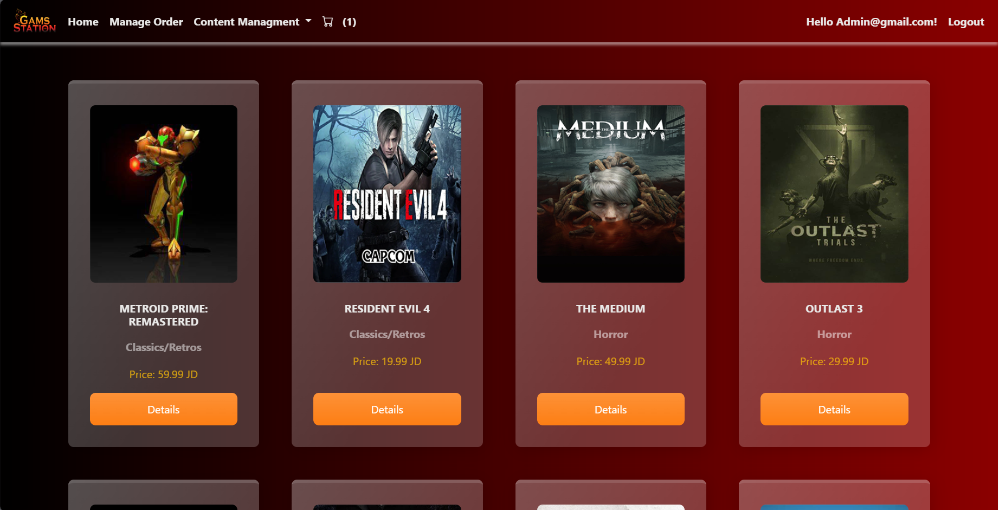
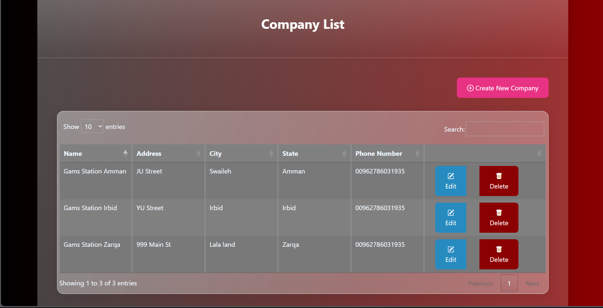
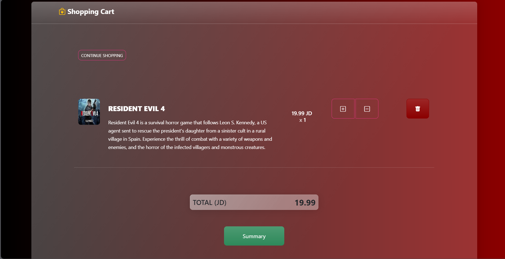
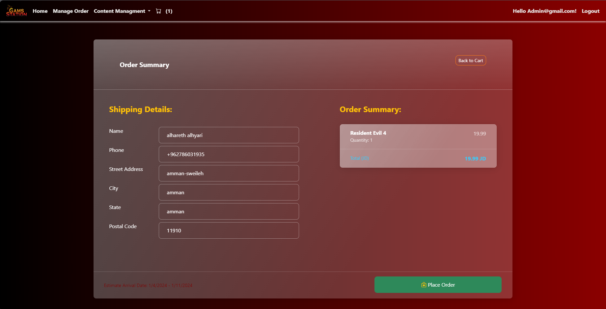

# Gams Station Ecommerce Project

## Overview
Welcome to Gams Station, an ecommerce project built on the .NET MVC 8 framework. This web application allows users to seamlessly browse, purchase, and enjoy their favorite video games. The system is equipped with a robust administrative interface that supports CRUD (Create, Read, Update, Delete) operations for Admin, Employee, Company, and Customer roles.

## Key Features
1. **Multiple Roles**
    - Admin: Full control over the system, including CRUD operations.
    - Employee: Assists in managing and updating product information.
    - Company: Manages details related to gaming companies and their products.
    - Customer: Enjoys a personalized shopping experience, with the ability to purchase multiple games.
2. **User-Friendly Interface**
    - Games Station boasts a user-friendly interface designed for ease of use. Customers can effortlessly navigate through the website, browse games, and make purchases without any hassle.
3. **Easy Checkout Process**
    - The ecommerce platform ensures a smooth and efficient checkout process. Customers can add multiple games to their cart and complete the purchase seamlessly.
4. **Performance Optimization**
    - Games Station prioritizes performance to provide users with a fast and responsive experience. The web application is optimized for quick loading times, ensuring a pleasant shopping experience.

## Installation
To set up Games Station locally, follow these steps:

- Clone the Repository:

    ```bash
    git clone https://github.com/alharet7/GamsStation
    ```

- Open in Visual Studio 2022:
    - Open the solution file (.sln) in Visual Studio 2022.
- Configure Database:
    - Update the connection string in the appsettings.json file to point to your Microsoft SQL Server instance.
- Database Migration:
    - Run the following commands in the Package Manager Console to apply migrations:

    ```bash
    Update-Database
    ```

- Build and Run:
    - Build the solution and run the application.
- Open in Browser:
    - Access the application in your web browser at http://localhost:port (replace port with the actual port number).
- **Note**:
  - How to use it as an admin:
  Use this Email:
   admin@gmail.com
  - This Password:
   Admin@123
  - If that did not work Just go and commint the Authorize attribute in **Register.cshtml** file Line **64** and use the Role Selector to Selcet Admin Role.
## Technology Stack
Games Station is built using the following technologies:

- **Framework**: .NET MVC 8
- **Integrated Development Environment**: Visual Studio 2022
- **Cloud Storage**: Azure BLOB Storage
 - **Payment Gateway**: Stripe
- **Database**: Microsoft SQL Server
- **Alerts**: Sweet Alert 2
- **Languages: C#**, JavaScript, HTML, CSS

## Screenshots





## License
This project is licensed under the MIT License. Feel free to contribute and make it even better!

Happy gaming with Games Station! 
